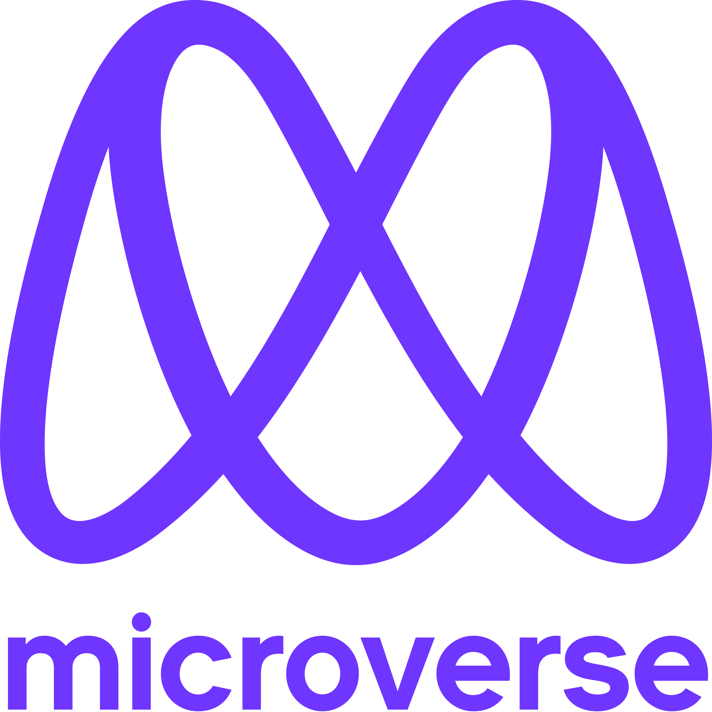

  
   

  <h3><b>Portoflio website</b></h3>

# 📗 Table of Contents

- [📖 About the Project](#about-project) 
🛠 Built With 
-Tech Stack 
-Key Features 
💻 Getting Started 
-Setup 
-Prerequisites 
- [👥 Authors](#authors) 
- [🔭 Future Features](#future-features)
- [🤝 Contributing](#contributing)
- [⭐️ Show your support](#support)

<!-- PROJECT DESCRIPTION -->

# 📖 [Portflolio website ] 

*[Portfolio website]* is a website which include my biography in software developement field
it includes :   
-my name   
-Programming languages that I know   
-My social media perofiles and links   
🛠 Built With 
**Key Features** 
simple portfolio project, built with html5 and css3 including linter configurattion. 

[Set up linters] 
[Add navigation bar for mobile version] 
[Add intro header section for mobile version] 
**Tech Stack** 
This portfolio project, was built with html5 and css3.

Client 
**.HTML**
**.CSS**

💻 Getting Started 
To get a local copy up and running, follow these steps. 

Prerequisites 
In order to run this project you need: 

Any IDE or text editor that supports HTML and CSS
Git installed 
Setup 
Clone this repository to your desired folder: 

1. Clone this repository or download the Zip folder:" 
$ git clone <https://github.com/ismailmunyentwari9/My-portfolio)> 
2. Navigate to the location of the folder in your machine: 
(https://github.com/ismailmunyentwari9/My-portfolio) 
**3. Press Enter to navigate to your local clone.**

(<a href="#readme-top">back to top</a>)

## 👥 Author

👤 *Ismail Munyentwari*

- GitHub: [@ismailmunyentwari9](https://github.com/ismailmunyentwari9)
- LinkedIn: [LinkedIn](https://www.linkedin.com/in/munyentwari-ismail-754718191/)

(<a href="#readme-top">back to top</a>)

## 🔭 Future Features 
-Create More pages   
-Adding a screen reader   
-adding direct emails to my email account   

(<a href="#readme-top">back to top</a>)

## ⭐️ Show your support 

This is my second project we will  feel loved when you  give us some positive comments and likes 

(<a href="#readme-top">back to top</a>)

